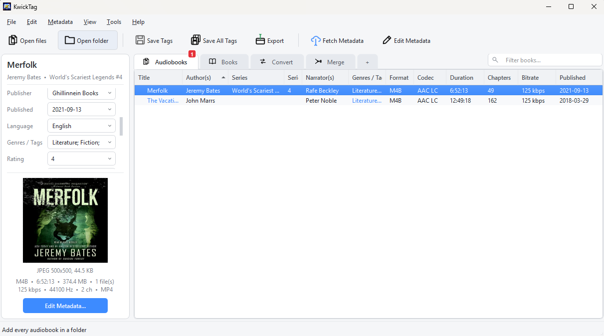
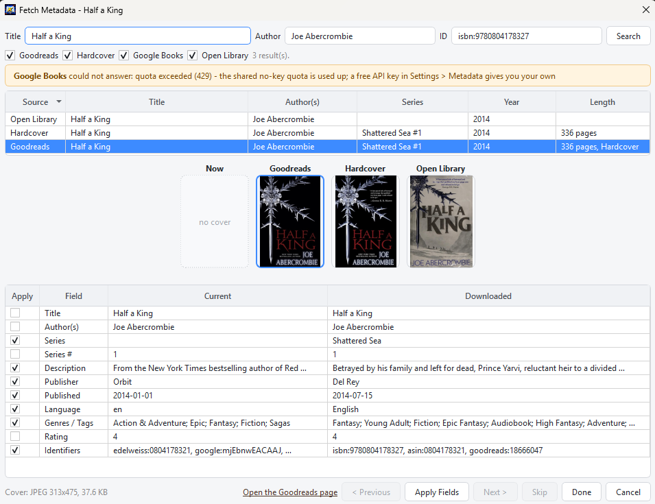

  

<h1 align="center">KwickTag</h1>

Fix, fetch and tidy your audiobook and ebook tags. Windows. Free.

  <a href="https://github.com/Kwickflix/kwicktag/releases/latest"><b>Download the latest version</b></a>

## What It Does

- **Fixes tags** on MP3, M4B and M4A audiobooks without re-encoding anything. Title, author, narrator, series, cover, description, chapters - all of it.
- **Ebooks too.** A Books tab for EPUB files: edit the metadata and cover inside the file, fetch details from Goodreads, Hardcover, Google Books and Open Library, and export into the same tidy layout with an OPF beside each book. Kindle files (MOBI, AZW3) are read as they are, and the Convert tab turns them into EPUB.
- **Fetches metadata** from Audible, Podium, Soundbooth, Hardcover, Google Books and Open Library for audiobooks, and from Goodreads, Hardcover, Google Books and Open Library for ebooks. You see the result before anything is written, and nothing is fetched unless you ask.
- **Merges parts** into one file. Drop a folder of chapter files, set the book's details once, and get a single M4B or MP3 with chapters.
- **Exports a clean library**: `Author, First \ Title \ Title - Author.m4b` with the cover picture beside it. Ready for Audiobookshelf, Plex, Jellyfin or a plain folder.
- **Edits in bulk.** Select twenty books and change the author, series or genre on all of them at once.
- **Fixes the new Audible codec.** Files in xHE-AAC, which Audiobookshelf, browsers and most players cannot play, are converted to ordinary AAC as they export. Plain AAC and MP3 files are never re-encoded.

## Get Started

1. Download the zip from the [releases page](https://github.com/Kwickflix/kwicktag/releases/latest).
2. Unzip it anywhere. There is nothing to install.
3. Run `KwickTag.exe`. Windows may ask once whether to trust it, because the app is not signed.
4. Drop audiobook or ebook files or folders onto the window.

For chapters and merging, KwickTag needs **FFmpeg**. Get it from [ffmpeg.org](https://ffmpeg.org/download.html) or install it with `winget install ffmpeg`, and the app finds it on its own.

## How to Use It

- **Drop files, then press Fetch Metadata.** Pick the right match, tick the fields you want, Apply. Move to the next book with Next.
- **Save Tags** writes your changes into the files where they are. Nothing moves.
- **Export** copies the books into the tidy folder layout, with the cover as a JPEG. Turn on *Delete Originals* if you want a move instead of a copy.
- **Merge tab.** Drop a book that comes as many files. It groups them, you set the details, press Merge Selected. Or tick *Merge Parts on Export* to do it as part of an export.
- **Convert tab.** Drop Kindle files, set the details, press Convert Selected. The EPUB appears on the Books tab.
- **Double-click a book** for the full editor: description, identifiers, chapters, cover.
- **Right-click the column headers** to choose which columns you see.

## Safe by Design

KwickTag never rewrites audio. Every tag write goes to a copy first, is checked, and only then replaces the original. If anything goes wrong the original file is untouched. Originals are only deleted after an export, merge or conversion has been verified.

## Questions or Problems

Open an [issue](https://github.com/Kwickflix/kwicktag/issues). If the app crashed, *Help > Open log folder* has a `kwicktag.log` that helps.

## Licence

KwickTag is free to download and use. The source code is not published.
